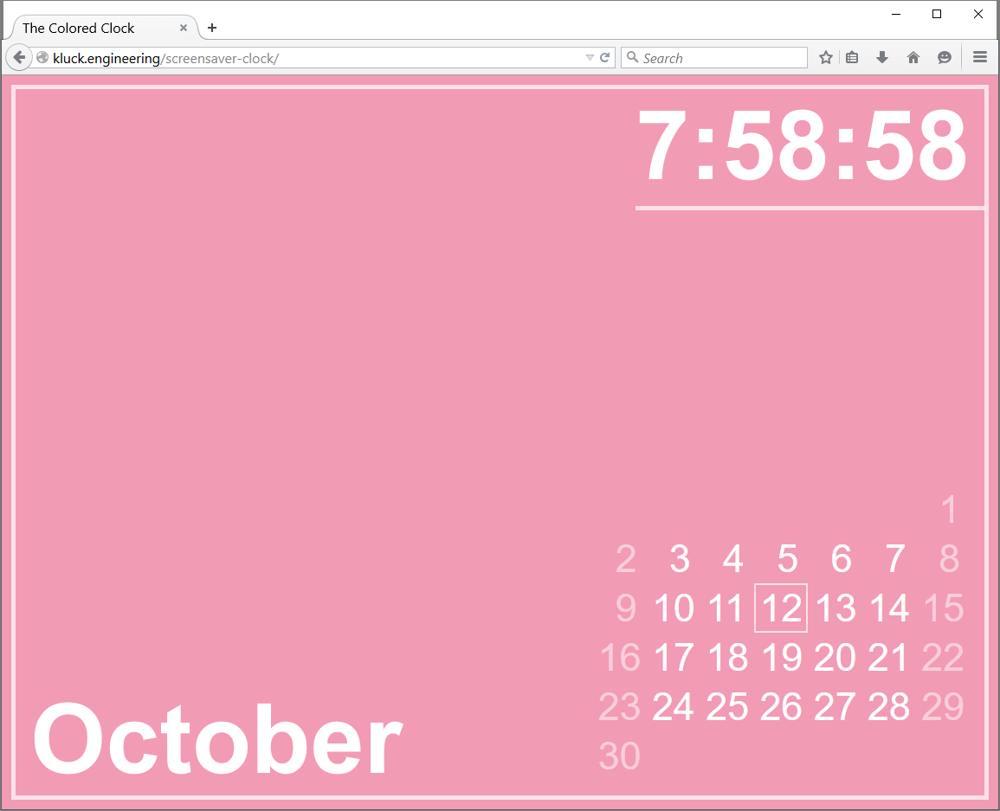

# Screensaver HTML Clock

Colorful HTML clock for use as a screensaver.

This *app* is designed to be a single-file html/js clock screensaver with no external dependencies to provide a
prettier alternative to the built-in clock screensavers provided by Mac OS or Windows.

An HTML screensaver is required:
- Mac OS - [Web Saver](https://github.com/tlrobinson/WebSaver)
- Windows - ???

### Example

